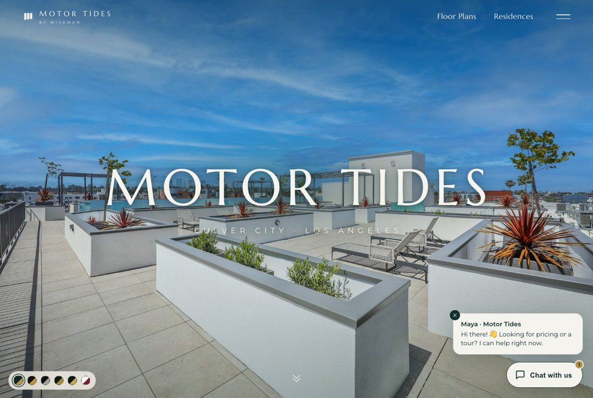
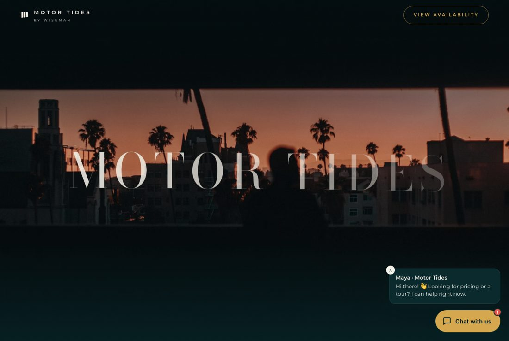
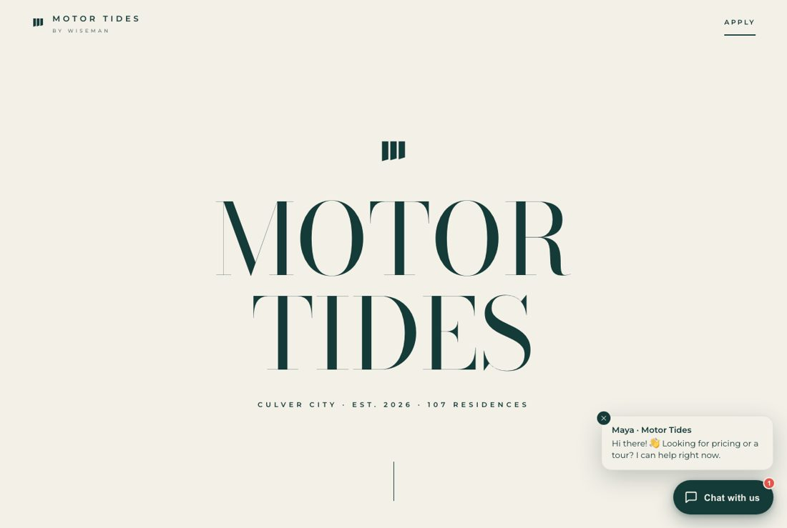
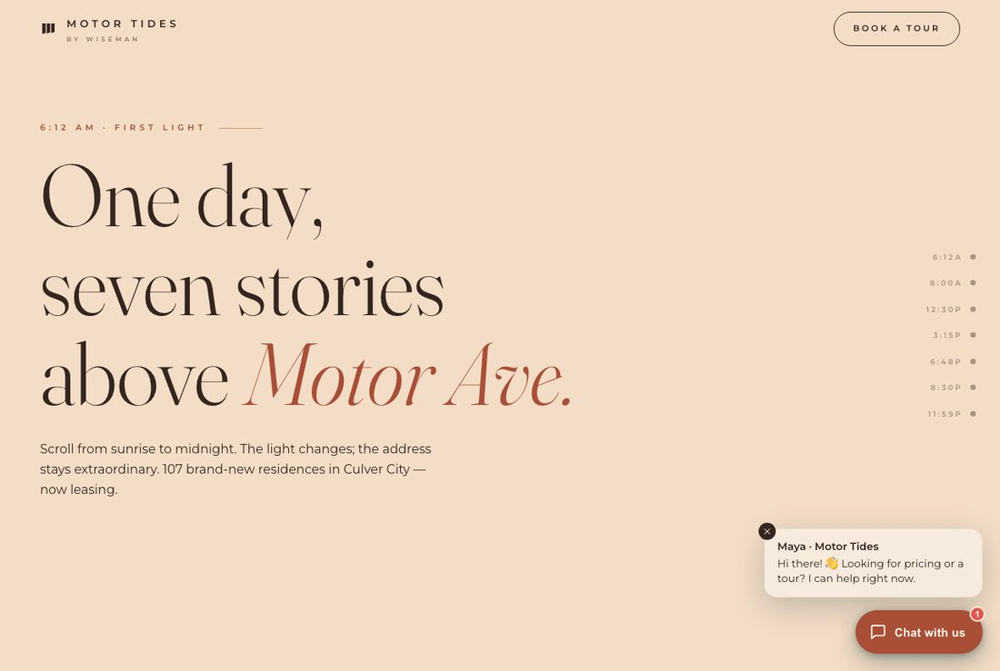
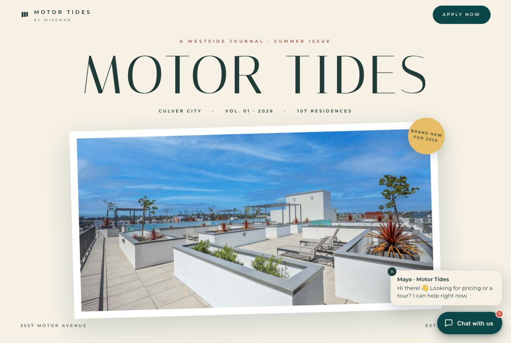
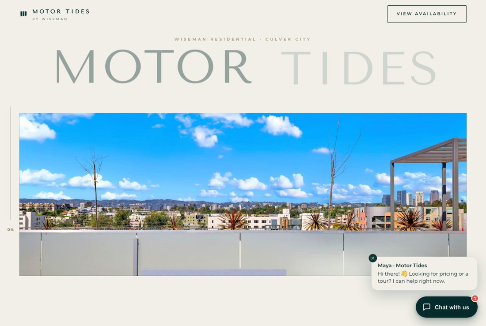

# Motor Tides — Website Redesign Concepts

Six complete, browsable website directions for **Motor Tides by Wiseman**, a brand-new
107-residence lease-up at 3557 Motor Avenue in Los Angeles — plus an AI leasing-concierge
chat widget that runs on every one of them.

Built to be pitched: each direction is a real multi-page site with the property's actual
copy, photography, floor plans, and pricing, deployed live so stakeholders can open a link
and scroll rather than squint at a mockup.

**▶ Start here: [motor-tides-concepts.vercel.app](https://motor-tides-concepts.vercel.app)** — the hub that presents all six.

---

## The six directions

| | | |
|:--|:--|:--|
| <a href="https://motor-tides-concept-e.vercel.app"></a><br>**01 · [Resort Immersive](https://motor-tides-concept-e.vercel.app)**<br><sub>The flagship. Six switchable themes.</sub> | <a href="https://motor-tides-concept-nocturne.vercel.app"></a><br>**02 · [Pacific Nocturne](https://motor-tides-concept-nocturne.vercel.app)**<br><sub>The property as an after-dark film.</sub> | <a href="https://motor-tides-concept-monogram.vercel.app"></a><br>**03 · [Living Monogram](https://motor-tides-concept-monogram.vercel.app)**<br><sub>Fashion-house typography.</sub> |
| <a href="https://motor-tides-concept-grandtour.vercel.app"></a><br>**04 · [The Grand Tour](https://motor-tides-concept-grandtour.vercel.app)**<br><sub>Sunrise to midnight in one scroll.</sub> | <a href="https://motor-tides-concept-riviera.vercel.app"></a><br>**05 · [Riviera Journal](https://motor-tides-concept-riviera.vercel.app)**<br><sub>A sun-drenched travel magazine.</sub> | <a href="https://motor-tides-concept-voyage.vercel.app"></a><br>**06 · [Voyage](https://motor-tides-concept-voyage.vercel.app)**<br><sub>A journey with a progress rail.</sub> |

Every direction shares the same spine — real plans and pricing, a leasing concierge, an apply
path — and differs in the one thing that carries it:

**01 · Resort Immersive** `option-e/` — Cream, pine, and brass. Each chapter's headline is drawn
twice, dark on paper and cream on photograph, and a clipping window sweeps across it as you
scroll, so the letters flip color one at a time until the image fills the frame. Ships six
runtime color-and-type themes — *Tide, Champagne, Noir, Olive, Midnight, Bordeaux* — switchable
live from a swatch control. Pages: home, residences, experience, location.

**02 · Pacific Nocturne** `option-nocturne/` — Deep teal night, antique gold, Bodoni Moda. Chapters
are numbered acts; interiors arrive through a film iris-wipe, a circle of light opening from the
corner of one photograph to reveal the next.

**03 · Living Monogram** `option-monogram/` — Bone paper, pine ink, terracotta. The words MOTOR and
TIDES are cut out of a single ocean photograph; scrolling pans the surf inside the letterforms,
then MOTOR blooms open into the full-bleed image, which contracts back down into TIDES.

**04 · The Grand Tour** `option-grandtour/` — The page moves through a day. Seven chapters each carry
a palette, and the site's live color variables interpolate between them as you scroll — dawn cream
to golden-hour peach to midnight — with a time rail marking the hour. Nav items are stamped with
the time they belong to.

**05 · Riviera Journal** `option-riviera/` — Paper cream, terracotta, Italiana masthead. Postcards tilt
and settle as they enter, and a white-matted rooftop postcard grows until its matte vanishes and
it *becomes* the full screen.

**06 · Voyage** `option-voyage/` — Bone and brass with blueprint line-work. A journey rail pinned to the
left edge fills with scroll progress and a live percentage; hover reveals six legs — Arrive, Reside,
Refine, Ascend, Belong, Choose — each clickable.

---

## The leasing concierge

`redesign/assets/chat.js` (778 lines, no dependencies) is a self-contained chat widget shared by
all 28 concept pages and themed per concept through `--mtc-*` custom properties. Scripted flows
cover pricing, tour scheduling, pets, amenities, neighborhood, parking, and applying, with
free-text keyword routing, typing indicators, and a teaser bubble.

Seven launcher personalities ship in the file, selectable via `window.MTC_VARIANT` or a `?chat=`
URL parameter: `pill` (used by the current concepts), `minimal`, `logo`, `agent`, `robot`,
`lighthouse`, and `buddy`. The hub links the archived concepts with `?chat=` variants so the
personalities can be demoed side by side.

> The bot is called an "AI leasing concierge" in all feature and marketing copy. The "Maya"
> persona appears only inside live demo conversations.

---

## Repository layout

```
.
├── .gitignore
└── redesign/
    ├── index.html            hub — numbered concept cards with live-site thumbnails
    ├── CONTENT.md            source of truth: address, plans, pricing, amenities, real URLs
    ├── DEMO-SCRIPT.md        talk track for the owner meeting
    ├── README.md             deeper notes on the concept set
    │
    ├── option-e/             01 Resort Immersive — 4 pages + shared style.css / app.js
    ├── option-nocturne/      02 Pacific Nocturne  \
    ├── option-monogram/      03 Living Monogram    |  4 self-contained pages each
    ├── option-grandtour/     04 The Grand Tour     |  (home, residences, floorplans, experience)
    ├── option-riviera/       05 Riviera Journal    |  with all CSS and JS inline
    ├── option-voyage/        06 Voyage            /
    │
    ├── option-a/  option-b/  option-c/    archived single-page explorations
    ├── option-current/       replica of the current live site with the concierge attached
    │
    ├── assets/
    │   ├── chat.js           shared leasing-concierge widget
    │   └── img/              property photography + floor-plan drawings
    │       ├── plans-trim/   margin-trimmed plan drawings used by the plan modals
    │       └── previews/     hub thumbnails (headless screenshots of each concept)
    │
    └── scripts/prep_deploy.py   builds the per-project deploy bundles
```

29 HTML pages, 33 property images, 7 floor-plan drawings.

---

## How it's built

Vanilla HTML, CSS, and JavaScript. No framework, no build step, no package manager — every page
opens directly in a browser. External runtime dependencies are only:

- **[Lenis](https://github.com/darkroomengineering/lenis)** for damped smooth scrolling (from unpkg)
- **Google Fonts** — a different display pairing per concept
- **Unsplash** for atmospheric imagery only; the property, interiors, and floor plans are always real photography

Shared conventions across the concepts:

- One `requestAnimationFrame` loop per page; `IntersectionObserver` for reveals; transform and
  opacity for motion.
- `prefers-reduced-motion` is honored on every page — pinning, parallax, and scroll choreography
  all collapse to static layouts.
- Every page has a skip link, a keyboard-navigable header, a hamburger menu under 760px, and a
  branded page-transition curtain between pages.
- The five newer concepts open a floor-plan modal (`<dialog>`) with the real drawing for each of
  the seven plans; Resort Immersive uses an inline preview panel instead.
- Apply, availability, and resident-login links point at the property's live SecureCafe and
  RentCafe endpoints.

---

## Running locally

```bash
git clone https://github.com/zhenwang-beep/motor-tides-redesign.git
cd "motor-tides-redesign/redesign"
python3 -m http.server 8737
```

Then open <http://localhost:8737/> for the hub, or a concept directly, e.g.
<http://localhost:8737/option-voyage/>.

A plain file server is enough — but do use one rather than opening files off disk, since the
pages fetch sibling pages and assets by relative path.

## Deploying

Each concept is its own Vercel project (11 in total, including the hub and the current-site
replica). Images resolve through `vercel.json` rewrites to the property's RentCafe CDN, so the
deployed bundles stay small.

```bash
python3 scripts/prep_deploy.py     # regenerate deploy/ for every project
cd deploy/voyage                   # or hub, e, nocturne, monogram, grandtour, riviera …
vercel link --yes --project motor-tides-concept-voyage --scope <scope>
vercel deploy --prod --yes
```

`redesign/deploy/` is generated output and is not tracked in git — always run `prep_deploy.py`
before deploying.

---

## Content accuracy

All property facts come from [`redesign/CONTENT.md`](redesign/CONTENT.md), extracted from the live
site. Seven real floor plans (Harbor, Reef, Pacific, Lighthouse, Seacliff, Channel, Coral) are
listed with real square footage, starting rents from $3,770 to $4,495, and availability counts.

Two caveats worth carrying into any client conversation:

- The mapping of floor-plan **drawings** to plan **names** is inferred from bedroom and
  unit-stack counts. It has not been confirmed by Wiseman.
- Pricing and availability are a point-in-time snapshot. The live leasing system is the
  authority, and every concept links to it.

## Archived explorations

Earlier directions, still live and linked quietly from the hub: **Coastal Editorial**
(`option-a/`, [live](https://motor-tides-concept-a.vercel.app)), **Architectural Dark**
(`option-c/`, [live](https://motor-tides-concept-c.vercel.app)), **Modern Platform**
(`option-b/`, [live](https://motor-tides-concept-b.vercel.app)), and **Estate Green**, which
exists only as a shared artifact link with no local source.

Also live: a [replica of the current site](https://motor-tides-current.vercel.app) with the
concierge attached (`option-current/`) — useful for showing the bot on the existing design
before any redesign is adopted.
